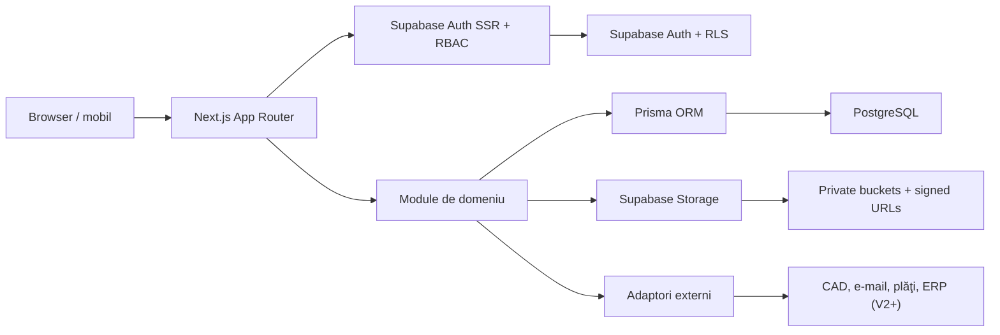

# Architecture — NEXO Smart Buildings

## Stil arhitectural

Aplicaţia este un **monolit modular** construit cu Next.js App Router şi TypeScript strict, deployat pe Vercel. Supabase furnizează Auth, Postgres, Storage şi RLS; Prisma acoperă datele de business complexe.



## Straturi şi responsabilităţi

| Strat | Responsabilitate |
| --- | --- |
| `src/app` | rute App Router, metadata, layout, Route Handlers şi pagini subţiri |
| `src/modules` | cazuri de utilizare, politici, scheme Zod, repository-uri şi tipuri de domeniu |
| `src/components` | design system şi componente de prezentare accesibile |
| `src/lib` | infrastructură transversală: Prisma, Supabase SSR, RBAC, audit, i18n, rate limit |
| `src/adapters` | porturi pentru S3, CAD, PDF, e-mail şi alte integrări |
| `prisma` | schema, migraţii şi seed controlat |

## Module de domeniu

- `identity`: utilizatori, organizaţii, roluri, sesiuni, consimţăminte;
- `catalog`: produse, categorii, producători, atribute, documentaţie şi compatibilităţi;
- `pricing`: reguli, versiuni de reguli, evaluator de estimări şi pachete;
- `configurators`: sesiuni Casă/Bloc/Hotel, paşi, răspunsuri şi rezultate;
- `projects`: proiecte, participanţi, statusuri, timeline, planuri 2D şi documente;
- `offers`: oferte, versiuni, linii, acceptare/respingere şi PDF;
- `commerce`: coş, comenzi şi stoc (MVP limitat la catalog şi pregătirea modelului);
- `content`: pagini, blog, formulare şi SEO;
- `admin`: operaţii administrative şi audit.

## Autorizare şi izolare

Supabase Auth gestionează `auth.users`, parolele şi sesiunile; aplicaţia nu stochează parole sau token-uri. `profiles.id` referă UUID-ul `auth.users.id`, iar clienţii browser/server folosesc `@supabase/ssr`. Service role este strict server-side.

RLS previne accesul direct neautorizat prin API-ul Supabase, iar politicile server-side verifică suplimentar rolul şi organizaţia pentru fiecare citire/mutaţie.

Administratorul gestionează date operaţionale; super-administratorul gestionează roluri globale şi configurare de sistem. Toate mutaţiile administrative relevante creează `AuditLog`.

## Upload şi documente

Flux: cerere autentificată → verificare permisiune proiect → validare MIME/dimensiune/semnătură fişier → cheie opacă în storage privat → metadate în PostgreSQL → URL semnat cu expirare pentru preview/download. PDF, PNG şi JPG au preview. DWG poate fi încărcat şi listat, dar nu este interpretat în browser; `CadConversionAdapter` furnizează ulterior conversia şi în dezvoltare răspunde mock.

## Estimare şi compatibilitate

`PricingRule` conţine scop, tip de aplicare, condiţii JSON validate, unitate, interval şi versiune. `EstimateService` primeşte răspunsurile normalizate, selectează regulile active şi produce defalcări explicabile. Nicio valoare nu este hardcodată în UI.

Compatibilităţile sunt muchii direcţionate între produse, cu tip şi stare de validare. `CompatibilityService` separă recomandările validate de avertismentele/elementele neverificate şi poate indica gateway, sursă sau licenţă necesare.

## Observabilitate şi securitate

- erori structurare server-side şi corelation ID, fără date personale în loguri;
- rate limiting pentru formulare publice şi upload;
- Supabase Auth SSR şi verificarea identităţii server-side;
- RLS SQL pentru profiluri, organizaţii, proiecte şi datele portalului;
- politici de retenţie configurabile, export şi cerere de ştergere a datelor;
- variabile de mediu validate la pornire.

## Repository

```text
.
├── src/
│   ├── app/                 # rute publice, portal, admin şi API
│   ├── modules/             # logica de domeniu modulară
│   ├── components/          # UI reutilizabil
│   ├── lib/                 # infrastructură comună
│   ├── adapters/            # porturi/implementări servicii externe
│   └── styles/
├── prisma/                  # schema, migraţii, seed
├── tests/                   # unit, integration, e2e
├── public/                  # asset-uri publice
├── docs/                    # ghiduri operaţionale şi ADR-uri
├── docker/                  # config local (ex. MinIO)
└── scripts/                 # seed şi operaţii de mentenanţă
```

## Deploy şi migraţii

GitHub este sursa de deploy automat Vercel. `DATABASE_URL` este pooled pentru runtime, `DIRECT_URL` este direct pentru migraţii, iar `postinstall` generează Prisma Client. Nu se foloseşte `prisma db push` în producţie şi nu se presupune un filesystem persistent.
